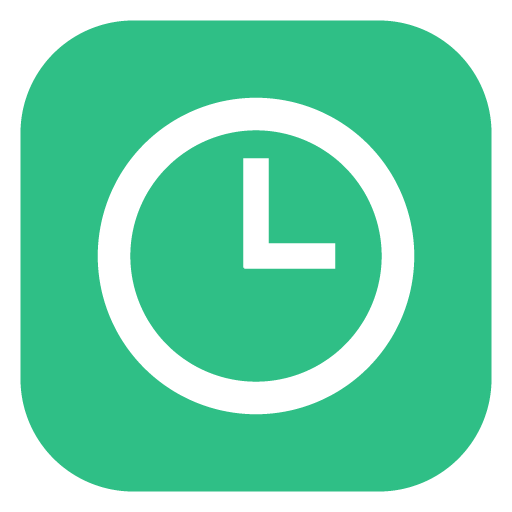
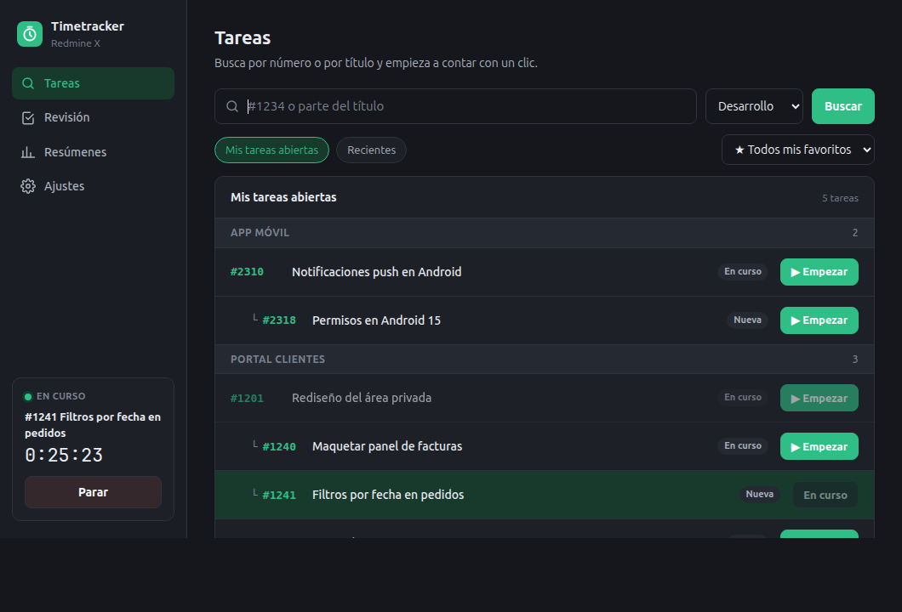
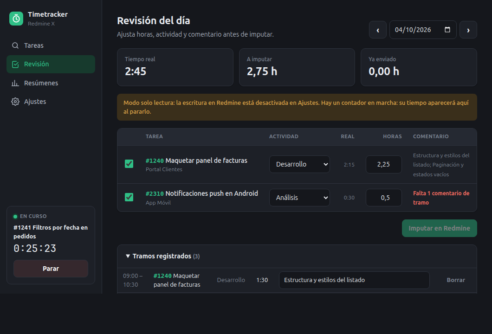
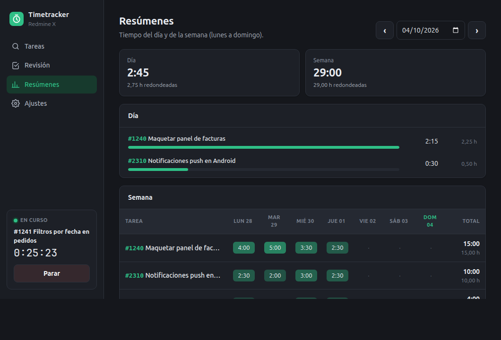
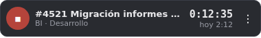
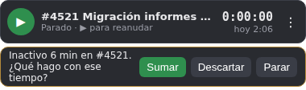
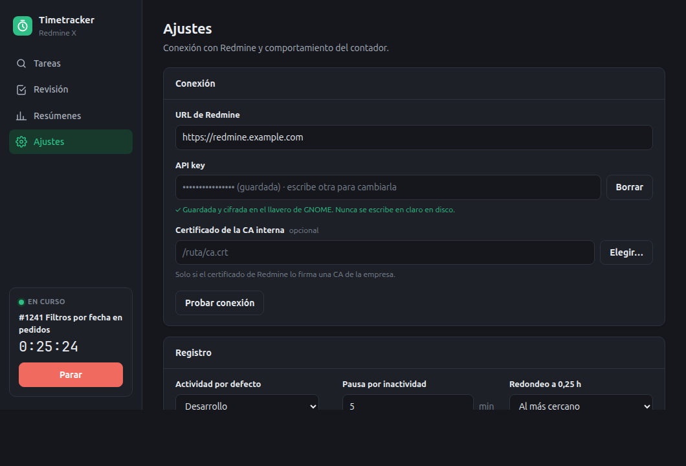

<div align="center">



# Timetracker Redmine

**Cronometra tu trabajo con un clic. Revísalo al final del día. Imputa en Redmine sin rellenar ni una sola hora a mano.**

[](https://www.electronjs.org/)
[](#-instalación)
[](LICENSE)
[](https://github.com/mgomezbuceta/redmine-timetracker/releases/latest)
[](https://github.com/mgomezbuceta/redmine-timetracker/actions/workflows/installers.yml)



</div>

---

## ¿Por qué?

Imputar horas en Redmine al final de la semana es una tarea de arqueología: ¿qué hice el martes a las once? **Timetracker Redmine** te quita ese problema. Un widget flotante siempre a la vista cuenta el tiempo de la tarea en la que estás, detecta cuándo te levantas de la silla y, al final del día, te presenta todo agrupado y redondeado para que lo revises y lo envíes a Redmine con un solo botón.

Y lo hace sin riesgos: **la app no escribe nada en Redmine hasta que tú lo permites expresamente**.

## ✨ Características

| | |
|---|---|
| ⏱️ **Widget flotante** | Pequeño, siempre encima, arrastrable y recuerda su posición. Muestra la tarea, el contador y el total del día. |
| 🔎 **Buscador inteligente** | Por número (`1234` o `#1234`) o por título. Con la caja vacía, tus tareas abiertas. |
| ⭐ **Tus proyectos primero** | Por defecto busca en tus **proyectos favoritos** de Redmine. Un filtro te deja elegir cualquier proyecto activo en el que participes. |
| 🌳 **Árbol de tareas** | Resultados agrupados por proyecto y con la jerarquía padre → subtareas, como en Redmine. |
| 🚫 **Sin ruido** | Las tareas de proyectos cerrados o archivados no aparecen nunca. |
| 💤 **Detección de inactividad** | Si te ausentas o suspendes el equipo, para el reloj donde empezó la inactividad y te pregunta: *Sumar*, *Descartar* o *Parar*. |
| ✍️ **Tiempo manual** | ¿Se te olvidó encender el contador? Elige la tarea, la fecha, la hora de inicio y las horas, y añádelo a mano. |
| 📝 **Revisión del día** | Agrupada por tarea y actividad, con redondeo a 0,25 h. Cada tramo lleva **su comentario obligatorio**, y con ellos se forma el comentario de la entrada de tiempo. |
| 📊 **Resúmenes** | Diario y semanal (de lunes a domingo), con barras y mapa de calor. |
| 🔐 **API key como una contraseña** | Cifrada con el almacén seguro del sistema y nunca en claro en disco. |
| 🏢 **Redmine corporativo** | Admite la CA interna de tu empresa (PEM o DER) sin desactivar jamás la verificación TLS. |
| 🔔 **Aviso de versión nueva** | Te avisa cuando hay una versión más reciente en GitHub, con un botón para descargarla. Se puede desactivar. |
| 🌗 **Tema claro y oscuro** | Sigue automáticamente el tema del sistema. |

<div align="center">


<br>


</div>

## ⚙️ Cómo funciona

```
 Buscar tarea ──▶ ▶ Empezar ──▶ Tramos de tiempo ──▶ Revisión del día ──▶ Imputar en Redmine
                                  (en tu equipo)      (agrupa, redondea,    (solo si lo permites
                                                       comentario por        y confirmas)
                                                       tramo)
```

1. **Cuentas**: eliges una tarea y pulsas *▶ Empezar*. Cada vez que paras, cambias de tarea o te ausentas, se guarda un **tramo** de tiempo en tu equipo.
2. **Revisas**: en *Revisión del día* los tramos se agrupan por tarea y actividad, con las horas redondeadas a 0,25 h (al más cercano o siempre hacia arriba). Puedes ajustar horas y actividad, desmarcar lo que no quieras enviar y escribir qué hiciste en cada tramo.
3. **Imputas**: *Imputar en Redmine* crea una entrada de tiempo por tarea y actividad, con los comentarios de sus tramos. Las filas enviadas quedan marcadas con el número de la entrada y no se pueden reenviar por error.

Todo el registro de tiempo vive en tu equipo. Redmine solo se consulta para buscar tareas y proyectos, y solo se escribe en él cuando tú lo decides.

## 📦 Instalación

### Versiones disponibles

| Sistema | Formato | Notas |
|---|---|---|
| 🐧 **Linux** (Ubuntu, Debian y derivadas) | `redmine-timetracker_<versión>_amd64.deb` | Configura solo el sandbox de Electron (perfil de AppArmor en Ubuntu 24.04) y añade la app al menú. |
| 🪟 **Windows** 10/11 | `Timetracker-Redmine-Setup-<versión>.exe` | Te deja elegir la carpeta de instalación. Se instala para tu usuario. |
| 🍎 **macOS** | `Timetracker-Redmine-<versión>-arm64.dmg` / `-x64.dmg` | `arm64` para Apple Silicon (M1–M4), `x64` para Intel. |
| 🛠️ **Código fuente** | `npm start` | Cualquier sistema con Node.js. Ideal para desarrollar. |

**[⬇️ Descarga la última versión](https://github.com/mgomezbuceta/redmine-timetracker/releases/latest)** desde *Releases*. Cada versión incluye `SHA256SUMS.txt` para comprobar las descargas.

### 🐧 Linux

```bash
sudo apt install ./redmine-timetracker_0.1.0_amd64.deb
```

Después búscala en el menú de aplicaciones como **Timetracker Redmine**. Para actualizar, instala el `.deb` nuevo encima: tus datos se conservan.

> **Actualizaciones:** la app consulta GitHub al arrancar y cada 6 horas y, si hay una versión nueva, te avisa con un botón para descargarla (en el panel y en el menú de la bandeja). Solo lee el número de la última versión publicada; no envía ningún dato tuyo. Se desactiva en *Ajustes → Avisar de versiones nuevas*.

### 🪟 Windows

Ejecuta el instalador `.exe`. Como no está firmado, Windows SmartScreen mostrará un aviso: pulsa **Más información → Ejecutar de todas formas**.

### 🍎 macOS

Abre el `.dmg` y arrastra la app a *Aplicaciones*. La primera vez, como no está firmada, ábrela con **clic derecho → Abrir** para saltar el aviso de desarrollador no identificado.

### 🛠️ Desde el código fuente

Requiere [Node.js](https://nodejs.org/) 20 o superior.

```bash
git clone https://github.com/mgomezbuceta/redmine-timetracker.git
cd redmine-timetracker
npm install
npm start
```

> **Ubuntu 24.04 desde el código fuente:** si al arrancar sale un error sobre `chrome-sandbox`, es la restricción de AppArmor de Ubuntu. Se arregla una vez (y tras cada reinstalación de dependencias) con:
> ```bash
> sudo chown root:root node_modules/electron/dist/chrome-sandbox
> sudo chmod 4755 node_modules/electron/dist/chrome-sandbox
> ```
> El paquete `.deb` ya lo hace por ti.

## 🔧 Configuración

La primera vez se abre la pestaña **Ajustes**:

1. **URL de Redmine**: la dirección de tu servidor, por ejemplo `https://redmine.tuempresa.com`. Tiene que ser `https://`: la app no envía la API key por una conexión sin cifrar.
2. **API key**: en Redmine, *Mi cuenta → Clave de acceso a la API*. Son 40 caracteres hexadecimales.
3. **Certificado de la CA interna** *(opcional)*: la app ya confía en los certificados del sistema (almacén de Windows, Llavero de macOS y CAs de Linux), así que si tu navegador abre Redmine sin avisos, normalmente no hace falta. Si al probar la conexión ves *self signed certificate in certificate chain*, elige aquí el `.crt`, `.pem` o `.cer` (PEM o DER) de la **CA raíz** de tu empresa, no el del servidor. Desde el navegador: candado → certificado → *Ruta de certificación* (o *Jerarquía*) → el de arriba del todo → exportar.
4. Pulsa **Probar conexión**: verás tu usuario y se cargarán las actividades.
5. Elige la **actividad por defecto**, el **aviso de inactividad** (minutos) y el **redondeo**.
6. **Permitir escribir en Redmine**: desactivado por defecto. Mientras lo esté, la app solo lee y el botón *Imputar en Redmine* no hace nada.

<div align="center">

</div>

### 🔐 Seguridad de la API key

- Se cifra con el almacén seguro de cada sistema: **llavero de GNOME o KWallet** en Linux, **Llavero** en macOS y **DPAPI** en Windows.
- Nunca se escribe en claro en disco. Si no hay un llavero seguro disponible, la app se niega a guardarla en lugar de guardarla sin cifrar.
- La ventana de la app nunca recibe la clave: solo sabe si hay una guardada.
- Puedes borrarla en cualquier momento desde *Ajustes*.

### 🛡️ Otras medidas de seguridad

- Ventanas aisladas (sandbox, aislamiento de contexto, sin Node.js) con una política de contenido estricta. No pueden navegar a otras páginas ni abrir ventanas, y solo pueden llamar a una lista cerrada de funciones de la app.
- Conexión con Redmine solo por HTTPS y con el certificado siempre verificado.
- Antes de imputar, la tarea y los comentarios se reconstruyen desde los tramos guardados, y las horas y la actividad se validan.
- Ejecutable endurecido con los *fuses* de Electron: no se puede usar como intérprete de Node.js y solo carga el código empaquetado de la app.
- Sin dependencias en tiempo de ejecución, y Dependabot vigila las de desarrollo y las de la CI.

### ✅ Verificar que un instalador es auténtico

Desde la versión 0.2.0, cada instalador de una release lleva una atestación de procedencia firmada por GitHub Actions. Para comprobar que lo ha generado este repositorio:

```bash
gh attestation verify redmine-timetracker_<versión>_amd64.deb -R mgomezbuceta/redmine-timetracker
```

## 🚀 Uso diario

| Quiero… | Cómo |
|---|---|
| Empezar a contar | Clic en el texto del widget → busca la tarea → **▶ Empezar**. |
| Parar o reanudar | Botón ■ / ▶ del widget, el panel o el menú del icono de la bandeja. |
| Buscar en un proyecto concreto | Desplegable de proyecto bajo el buscador (favoritos primero, luego los proyectos en los que participas). |
| Volver a una tarea reciente | Chip **Recientes** en el buscador. |
| Imputar sin el contador | **＋ Horas** en cualquier tarea del buscador, o **＋ Tiempo manual** en *Revisión del día*: fecha, hora de inicio, horas, actividad y comentario. Se revisa e imputa como el resto. |
| Ausentarme | No hagas nada: al volver, la app te pregunta qué hacer con ese tiempo. |
| Cerrar el día | Menú → **Revisión del día**: comenta cada tramo, ajusta y pulsa **Imputar en Redmine**. |
| Corregir un error | En *Tramos registrados* puedes borrar un tramo equivocado antes de imputar. |
| Ver cómo va la semana | Pestaña **Resúmenes**. |
| Ver la versión o informar de un problema | Pestaña **Acerca de** (o menú del icono de la bandeja → *Acerca de*). |

### Dónde se guardan tus datos

| Sistema | Carpeta |
|---|---|
| Linux | `~/.config/redmine-timetracker/` |
| Windows | `%APPDATA%\redmine-timetracker\` |
| macOS | `~/Library/Application Support/redmine-timetracker/` |

- `settings.json`: configuración (con la API key cifrada).
- `data.json`: tramos de tiempo, recientes y envíos realizados.

Si la app se cierra de golpe con el reloj en marcha, al volver corta en el último latido (cada 30 s) y te pregunta qué hacer con el hueco.

## 🧑‍💻 Desarrollo

```bash
npm test             # tests (node:test, sin dependencias)
npm run dist:linux   # .deb (en Linux)
npm run dist:win     # instalador .exe (en Windows)
npm run dist:mac     # .dmg (en macOS)
```

Los instaladores salen en `instaladores/`. Para generar los tres a la vez, lanza el workflow **installers** desde la pestaña *Actions* o sube una etiqueta `v<versión>` (por ejemplo `v0.1.0`). Al lanzarlo a mano, los instaladores quedan como artefactos de la ejecución; con una etiqueta, además se crea (o actualiza) la release de esa versión con los instaladores y `SHA256SUMS.txt` adjuntos.

### Ramas

- `main`: versiones publicadas. Protegida: solo cambia mediante pull request.
- `develop`: integración del trabajo en curso.
- `feature/…`, `fix/…`, `docs/…`: una rama por cambio, que sale de `develop` y vuelve a ella mediante pull request.

```
src/        proceso principal: temporizador, inactividad, cliente de Redmine, cifrado de la API key
renderer/   interfaz: panel (tareas, revisión, resúmenes, ajustes) y widget flotante
assets/     iconos (generados con scripts/make-icons.js)
test/       tests de la lógica, del cliente de Redmine contra un servidor simulado y del cifrado
```

### Notas técnicas

- Usa la API REST estándar de Redmine (`/issues.json`, `/projects.json`, `/enumerations/time_entry_activities.json` y `POST /time_entries.json`), con la sintaxis de filtros `f[]/op/v`, necesaria para el filtro de favoritos (`bookmarks`).
- En Linux fuerza XWayland (`--ozone-platform=x11`), porque en Wayland nativo una ventana no puede ponerse siempre encima.
- En GNOME la inactividad se lee de Mutter por D-Bus (también en Wayland). En el resto de sistemas, del `powerMonitor` de Electron.
- El icono de la bandeja en GNOME necesita la extensión AppIndicator, activada de serie en Ubuntu. Sin ella, el botón ⋮ del widget ofrece el mismo menú.

## 📄 Licencia

Distribuido bajo la licencia [Apache 2.0](LICENSE).

---

<div align="center">

Hecho con ⏱️ por **[Marcos Gómez Buceta](https://github.com/mgomezbuceta)**

</div>
